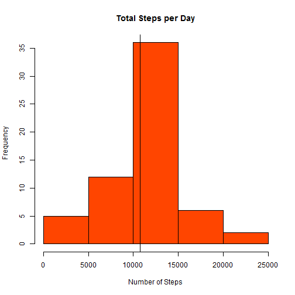

## Download and reading and preprocessing the project data set
The data for this assignment can be downloaded from the course web site: <http://rmarkdown.rstudio.comhttps://d396qusza40orc.cloudfront.net/repdata%2Fdata%2Factivity.zip>.

The following code chunk checks the presence of the project's folder in the current work
directory. If the folder doesn't exist, I create it, download the zip file and unzip it.

The data-set is stored in a comma-separated-value (CSV).
I read the file with read.csv, and stored it in "activity_data" data frame.


```r
if(!file.exists("./project_1_data")){
    dir.create("./project_1_data")
    fileUrl <- "https://d396qusza40orc.cloudfront.net/repdata%2Fdata%2Factivity.zip"

    download.file(fileUrl, 
                 destfile = "./project_1_data/data_activity.zip", method = "curl")
    unzip(zipfile = "./project_1_data/data_activity.zip",
          exdir = "./project_1_data")

}
files <- list.files("./project_1_data")

activity_data <- read.csv(paste("./project_1_data",files[1],sep = "/"))
str(activity_data)
```

```
## 'data.frame':	17568 obs. of  3 variables:
##  $ steps   : int  NA NA NA NA NA NA NA NA NA NA ...
##  $ date    : Factor w/ 61 levels "2012-10-01","2012-10-02",..: 1 1 1 1 1 1 1 1 1 1 ...
##  $ interval: int  0 5 10 15 20 25 30 35 40 45 ...
```

## What is mean total number of steps taken per day?

Calculate the total number of steps taken per day knowing that the colon "steps" 
contains the number of steps taking in a 5-minute interval (missing values are coded as NA),
and the colon "date" is a factor with the dates of the collected data


```r
Total_steps_day <- sapply(split(activity_data,activity_data$date), function(x) { 
    sum(x[,"steps"], na.rm = TRUE) 
})
str(Total_steps_day)
```

```
##  Named int [1:61] 0 126 11352 12116 13294 15420 11015 0 12811 9900 ...
##  - attr(*, "names")= chr [1:61] "2012-10-01" "2012-10-02" "2012-10-03" "2012-10-04" ...
```
Make a histogram of the total number of steps taken each day


```r
hist(Total_steps_day, col = "orangered", xlab = "Number of Steps",
     main = "Total Steps per Day Histogram")
```


```r
mean_steps_per_day <- mean(Total_steps_day)
mean_steps_per_day
```

```
## [1] 9354.23
```

```r
median_steps_per_day <- median(Total_steps_day)
median_steps_per_day
```

```
## [1] 10395
```

## What is the average daily activity pattern?

Make a time series plot (i.e. type = "l") of the 5-minute interval (x-axis) 
and the average number of steps taken, averaged across all days (y-axis)

Which 5-minute interval, on average across all the days in the dataset,
contains the maximum number of steps?


```r
activity_data$interval_factor <- as.factor(activity_data$interval)
str(activity_data)
```

```
## 'data.frame':	17568 obs. of  4 variables:
##  $ steps          : int  NA NA NA NA NA NA NA NA NA NA ...
##  $ date           : Factor w/ 61 levels "2012-10-01","2012-10-02",..: 1 1 1 1 1 1 1 1 1 1 ...
##  $ interval       : int  0 5 10 15 20 25 30 35 40 45 ...
##  $ interval_factor: Factor w/ 288 levels "0","5","10","15",..: 1 2 3 4 5 6 7 8 9 10 ...
```

```r
mean_steps_per_interval <- sapply(split(activity_data,activity_data$interval_factor)
                                 , function(x) { mean(x[,"steps"], na.rm = TRUE) 
})
str(mean_steps_per_interval)
```

```
##  Named num [1:288] 1.717 0.3396 0.1321 0.1509 0.0755 ...
##  - attr(*, "names")= chr [1:288] "0" "5" "10" "15" ...
```

```r
plot(mean_steps_per_interval, type = "l", ylab = "Number of Steps",
     xlab = "Interval", main = "Number of Steps as a Function of Time")
```


```r
i_max <- which(mean_steps_per_interval == max(mean_steps_per_interval, na.rm = TRUE))

mean_steps_per_interval[i_max]
```

```
##      835 
## 206.1698
```

```r
activity_data$interval[i_max]
```

```
## [1] 835
```
The 5-minute interval that contains the mean-maximum number of steps is 
between 8:30 and 8:35.

## Imputing missing values
Calculate and report the total number of missing 
values in the dataset (i.e. the total number of rows with NAs)


```r
sum(is.na(activity_data$steps))
```

```
## [1] 2304
```


1. Devise a strategy for filling in all of the missing values in the dataset. The strategy
does not need to be sophisticated. For example, you could use the mean/median for that day,
or the mean for that 5-minute interval, etc.

2. Create a new dataset that is equal to the original dataset but with the missing data filled in.

Here I decided to fill the missing (NA) values with the mean of steps in 5-minutes interval
(37.38 steps). 


```r
activity_data$steps[is.na(activity_data$steps)] <-  mean(activity_data$steps, na.rm = TRUE)
```
Make a histogram of the total number of steps taken each day and Calculate and report the
mean and median total number of steps taken per day. 


```r
Total_steps_day <- sapply(split(activity_data,activity_data$date), function(x) { 
    sum(x[,"steps"]) 
})
str(Total_steps_day)
```

```
##  Named num [1:61] 10766 126 11352 12116 13294 ...
##  - attr(*, "names")= chr [1:61] "2012-10-01" "2012-10-02" "2012-10-03" "2012-10-04" ...
```

```r
hist(Total_steps_day, col = "orangered", xlab = "Number of Steps",
     main = "Total Steps per Day")

mean_steps_per_day <- mean(Total_steps_day)
mean_steps_per_day
```

```
## [1] 10766.19
```

```r
median_steps_per_day <- median(Total_steps_day)
median_steps_per_day
```

```
## [1] 10766.19
```

```r
abline(v=mean_steps_per_day)
```



Do these values differ from the
estimates from the first part of the assignment? What is the impact of imputing missing data
on the estimates of the total daily number of steps?

Yes, the values slightly differ from the previous estimation. Namely, the mean and median
in the modified dataset get the same value, and this value is higher than those estimated from the original data (10766 here versus mean = 9354.23 and median = 10395 in row data).

## Are there differences in activity patterns between weekdays and weekends?

Create a new factor variable in the dataset with two levels - "weekday" and "weekend"
indicating whether a given date is a weekday or weekend day.


```r
activity_data$day <- weekdays(as.Date(activity_data$date))

activity_data$weekend_factor <- as.factor( ifelse(activity_data$day == "samedi" | 
                                    activity_data$day == "dimanche", "weekend", "weekday"))
```

Make a panel plot containing a time series plot (i.e. type = "l") of the 5-minute 
interval (x-axis) and the average number of steps taken, averaged across all weekday 
days or weekend days (y-axis).


```r
activity_data_weekday <- subset(activity_data, weekend_factor == "weekday")
str(activity_data_weekday)
```

```
## 'data.frame':	12960 obs. of  6 variables:
##  $ steps          : num  37.4 37.4 37.4 37.4 37.4 ...
##  $ date           : Factor w/ 61 levels "2012-10-01","2012-10-02",..: 1 1 1 1 1 1 1 1 1 1 ...
##  $ interval       : int  0 5 10 15 20 25 30 35 40 45 ...
##  $ interval_factor: Factor w/ 288 levels "0","5","10","15",..: 1 2 3 4 5 6 7 8 9 10 ...
##  $ day            : chr  "lundi" "lundi" "lundi" "lundi" ...
##  $ weekend_factor : Factor w/ 2 levels "weekday","weekend": 1 1 1 1 1 1 1 1 1 1 ...
```

```r
mean_steps_per_interval_wday <-
    sapply(split(activity_data_weekday,activity_data_weekday$interval_factor)
           , function(x) { mean(x[,"steps"], na.rm = TRUE) 
})
str(mean_steps_per_interval_wday)
```

```
##  Named num [1:288] 7.01 5.38 5.14 5.16 5.07 ...
##  - attr(*, "names")= chr [1:288] "0" "5" "10" "15" ...
```

```r
activity_data_weekend <- subset(activity_data, weekend_factor == "weekend")
str(activity_data_weekend)
```

```
## 'data.frame':	4608 obs. of  6 variables:
##  $ steps          : num  0 0 0 0 0 0 0 0 0 0 ...
##  $ date           : Factor w/ 61 levels "2012-10-01","2012-10-02",..: 6 6 6 6 6 6 6 6 6 6 ...
##  $ interval       : int  0 5 10 15 20 25 30 35 40 45 ...
##  $ interval_factor: Factor w/ 288 levels "0","5","10","15",..: 1 2 3 4 5 6 7 8 9 10 ...
##  $ day            : chr  "samedi" "samedi" "samedi" "samedi" ...
##  $ weekend_factor : Factor w/ 2 levels "weekday","weekend": 2 2 2 2 2 2 2 2 2 2 ...
```

```r
mean_steps_per_interval_wend <-
    sapply(split(activity_data_weekend,activity_data_weekend$interval_factor)
           , function(x) { mean(x[,"steps"], na.rm = TRUE) 
})
str(mean_steps_per_interval_wend)
```

```
##  Named num [1:288] 4.67 4.67 4.67 4.67 4.67 ...
##  - attr(*, "names")= chr [1:288] "0" "5" "10" "15" ...
```

```r
par(mfrow = c(2,1))

plot(mean_steps_per_interval_wday, ylab = "steps",
         main = "weekday", xlab = "interval", type = "l", col = "red" )

    
plot(mean_steps_per_interval_wend, ylab = "steps",
         main = "weekend", xlab = "interval", type = "l", col = "red" )
```


From the graph I can conclude that the "mean-activity" during the Weekend days starts and stops later than the activity during the week days.


